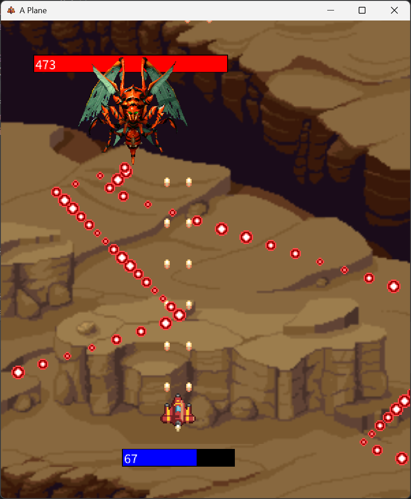

By Dean Tumabcao & Bengy for a high school assignment. Coded with Java and love. Uploaded to GitHub for archival.

# Version 1.0.4

**Latest Minor**
* Released my 1st Windows EXE of a Java project! :D
* Changed names of folders

## About
A 2D top-down shooter video game where you can take down an alien bug. For Freedom and Managed Democracy! Game made before Helldivers 2. 
### 🎞️ Trailer
https://github.com/dtumabcaofhs/A-Plane/assets/143454140/6ccc30fe-34af-4a51-90c6-ae345c22cc63
### 📷 Screenshot

### 📖 A Plane Guide
#### 👋 Introduction
Welcome to **A PLANE**! In this video game, you play as a Ultra Earth Air Force pilot. You are ordered to destroy the Insektisoid (totally didn't just come up with that) Queen to hinder their growth and to spread Managed Demoracy, Family Values and Freedom across the stars.
#### 🔫 How To Pilot
* ⬇️↙️⬇️⬅️ Use 'WASD' to move your ship.
* 🔫 Press left or right mouse button or spacebar to shoot.
#### 🧩 The Fundamentals
* 🚀 Your ship has 100 HP
* 🦟 The Insekticoid Queen has 500 HP.
* 🔫 Your ship has two projectile launchers. Proton Cannons and Torpedo Launchers.
* 💥 Each Proton deals 1 HP of damage, while each torpedo deals 10 HP of damage but fire in slower succession to Protons.

#### Start blastin' and protect our democracy.
